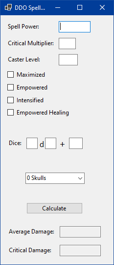

# DDO Spell Damage Calculator
A calculator for spell damage in Dungeons and Dragons Online.

Choose spell power, any critical multipliers you have, the caster level of the spell, and metamagic being applied. Then just input the base spell dice alongside whatever Reaper level you might be running.

The output is both standard damage and critical damage.

